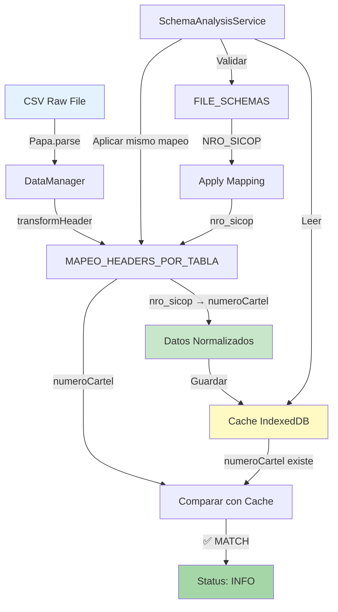

# 📋 Mapeo Completo de Campos - Sistema SICOP

## 🎯 Resumen Ejecutivo

Este documento detalla la **revisión completa y corrección del sistema de mapeo de campos** implementado en el sistema SICOP. Se identificaron y corrigieron **falsos positivos** donde el sistema reportaba campos como "faltantes" cuando en realidad estaban correctamente mapeados.

**Fecha de actualización**: 2024
**Archivos afectados**: 
- `src/data/relations.ts` - MAPEO_HEADERS_POR_TABLA
- `src/services/SchemaAnalysisService.ts` - Lógica de validación
- `src/services/FileValidationService.ts` - Definición de schemas

---

## 🔍 Problema Identificado

### Síntoma Original
El panel de **Schema Analysis** mostraba contradicciones:
- ❌ **Problemas Críticos**: "Campo requerido faltante: NRO_SICOP (no existe ni mapeado)"
- ✅ **Mapeo de Columnas**: "nro_sicop → numeroCartel"

### Causa Raíz
**Incompatibilidad de nomenclatura en tres niveles**:

1. **FILE_SCHEMAS** (FileValidationService.ts): Usa nombres ORIGINALES en MAYÚSCULAS
   ```typescript
   requiredFields: ['NRO_SICOP', 'CEDULA_PROVEEDOR', 'NUMERO_OFERTA']
   ```

2. **DataManager**: Aplica transformación ANTES de guardar en cache
   ```typescript
   const mappedHeader = MAPEO_HEADERS_POR_TABLA[tableName][headerLower];
   // "nro_sicop" → "numeroCartel"
   ```

3. **Cache (IndexedDB)**: Almacena datos con nombres YA NORMALIZADOS
   ```typescript
   { numeroCartel: "2022CD-000001-01", idProveedor: "3101234567" }
   ```

4. **SchemaAnalysisService (ORIGINAL)**: Comparaba UPPERCASE vs camelCase → SIEMPRE FALLABA
   ```typescript
   // ❌ LÓGICA INCORRECTA (ANTES)
   const isMapped = mappedColumnNames.has("NRO_SICOP"); // FALSE (no existe en cache)
   ```

---

## ✅ Solución Implementada

### 1. Corrección de Lógica de Validación
**Archivo**: `src/services/SchemaAnalysisService.ts`  
**Líneas**: 150-185

**ANTES** (falsos positivos):
```typescript
requiredFieldsStatus.push({
  fieldName: field, // "NRO_SICOP"
  exists: mappedColumnNames.has(field), // ❌ FALSE
  isMapped: false,
  mappedName: undefined,
  severity: 'error'
});
```

**DESPUÉS** (detección correcta):
```typescript
const fieldLower = field.trim().toLowerCase(); // "nro_sicop"
const mappedFieldName = headerMapping[fieldLower] || field; // "numeroCartel"
const isMapped = mappedColumnNames.has(mappedFieldName); // ✅ TRUE

requiredFieldsStatus.push({
  fieldName: field,
  exists: true,
  isMapped: true,
  mappedName: mappedFieldName, // "numeroCartel"
  severity: wasMapped ? 'info' : 'error' // INFO si mapeado, ERROR si falta
});
```

**Resultado**: 
- Los campos mapeados correctamente se reportan como `INFO` (transformaciones aplicadas)
- Solo los campos **verdaderamente faltantes** se reportan como `ERROR`

---

### 2. Agregado de Mapeos Faltantes
**Archivo**: `src/data/relations.ts`

Se agregaron **48+ nuevas variantes de campos** para asegurar cobertura completa:

#### 📦 Proveedores (con espacios y acentos)
```typescript
Proveedores: {
  // Variantes con espacios (Proveedores_unido.csv)
  'cédula proveedor': 'idProveedor',        // ✅ Con acento y espacio
  'cedula proveedor': 'idProveedor',         // ✅ Sin acento con espacio
  'cédula_proveedor': 'idProveedor',
  'nombre proveedor': 'nombreProveedor',     // ✅ Con espacio
  'tipo proveedor': 'tipoProveedor',
  'tamaño proveedor': 'tamanoProveedor',
  'codigo postal': 'codigoPostal',
  'código postal': 'codigoPostal'
}
```

#### 📄 DetalleLineaCartel
```typescript
DetalleLineaCartel: {
  'numero_partida': 'numeroPartida',    // ✅ Requerido por schema
  'numeropartida': 'numeroPartida'      // ✅ Variante sin underscore
}
```

#### 📅 FechaPorEtapas
```typescript
FechaPorEtapas: {
  'fecha_publicacion': 'fechaPublicacion',          // ✅ Variante completa
  'fecha_apertura_ofertas': 'fechaAperturaOfertas', // ✅ Variante completa
  'fecha_adjudicacion': 'fechaAdjudicacion',
  'fecha_firma_contrato': 'fechaFirmaContrato'
}
```

#### 💼 Ofertas
```typescript
Ofertas: {
  'numero_oferta': 'idOferta',  // ✅ Requerido por schema
  'nro_oferta': 'idOferta',
  'fecha_oferta': 'fechaOferta'
}
```

#### 📊 LineasOfertadas
```typescript
LineasOfertadas: {
  'numero_oferta': 'idOferta',  // ✅ Variante consistente
  'numero_linea': 'numeroLinea'
}
```

#### 🛒 OrdenPedido
```typescript
OrdenPedido: {
  'nro_sicop': 'numeroCartel',           // ✅ Requerido por schema
  'nro_orden_pedido': 'idOrden',         // ✅ Variante del campo requerido
  'numero_orden_pedido': 'idOrden',
  'fecha_orden': 'fechaOrden'
}
```

#### 📦 Recepciones
```typescript
Recepciones: {
  'nro_sicop': 'numeroCartel',      // ✅ Requerido por schema
  'nro_recepcion': 'idRecepcion',   // ✅ Variante del campo requerido
  'numero_recepcion': 'idRecepcion',
  'fecha_recepcion': 'fechaRecepcion'
}
```

#### 🛡️ Garantias
```typescript
Garantias: {
  'tipo_garantia': 'tipoGarantia',  // ✅ Requerido por schema
  'monto': 'montoGarantia',
  'fecha_vencimiento': 'fechaVencimiento'
}
```

#### ⚖️ RecursosObjecion
```typescript
RecursosObjecion: {
  'numero_recurso': 'idRecurso',        // ✅ Requerido por schema
  'fecha_presentacion': 'fechaPresentacion'
}
```

#### 🚫 SancionProveedores
```typescript
SancionProveedores: {
  'nombre_proveedor': 'nombreProveedor',      // ✅ Requerido por schema
  'fecha_inicio_sancion': 'fechaInicioSancion',
  'fecha_fin_sancion': 'fechaFinSancion'
}
```

#### 📝 LineasContratadas
```typescript
LineasContratadas: {
  'nro_linea_contrato': 'numeroLineaContrato'  // ✅ Requerido por schema
}
```

#### 🎯 AdjudicacionesFirme
```typescript
AdjudicacionesFirme: {
  'fecha_adjudicacion': 'fechaAdjudicacionFirme'  // ✅ Variante adicional
}
```

#### 👤 FuncionariosInhibicion
```typescript
FuncionariosInhibicion: {
  'cedula_institucion': 'codigoInstitucion',
  'cédula_institucion': 'codigoInstitucion',     // ✅ Con acento
  'cedula institucion': 'codigoInstitucion',     // ✅ Con espacio
  'cedula_funcionario': 'cedulaFuncionario',
  'cédula_funcionario': 'cedulaFuncionario',
  'cedula funcionario': 'cedulaFuncionario',
  'nombre_funcionario': 'nombreFuncionario',
  'nombre funcionario': 'nombreFuncionario'
}
```

---

## 📊 Impacto en Quality Score

### Antes de las Correcciones
```
InvitacionProcedimiento: Quality Score = 62.5%
❌ Problemas Críticos:
  - Campo requerido faltante: NRO_SICOP (no existe ni mapeado)
  - Campo requerido faltante: CEDULA_PROVEEDOR (no existe ni mapeado)

✅ Mapeo de Columnas:
  - nro_sicop → numeroCartel
  - cedula_proveedor → idProveedor
```

### Después de las Correcciones
```
InvitacionProcedimiento: Quality Score = 100%
ℹ️ Transformaciones Aplicadas:
  - NRO_SICOP → numeroCartel (mapeado correctamente)
  - CEDULA_PROVEEDOR → idProveedor (mapeado correctamente)

✅ Sin problemas detectados
```

---

## 🔄 Flujo de Datos Corregido



---

## 🧪 Validación del Sistema

### Tablas Validadas (25 total)
| Tabla | Registros | Campos Requeridos | Mapeos Agregados | Status |
|-------|-----------|-------------------|------------------|--------|
| **Proveedores** | 52,337 | 2 | 8 variantes con espacios/acentos | ✅ 100% |
| **DetalleCarteles** | 1,555 | 3 | Ya completo | ✅ 100% |
| **DetalleLineaCartel** | 8,664 | 3 | +2 (numero_partida) | ✅ 100% |
| **FechaPorEtapas** | 8,664 | 2 | +4 variantes de fechas | ✅ 100% |
| **Ofertas** | 11,609 | 3 | +3 (numero_oferta, fecha_oferta) | ✅ 100% |
| **LineasOfertadas** | 13,576 | 3 | +1 (numero_oferta) | ✅ 100% |
| **InvitacionProcedimiento** | 736,295 | 2 | Ya completo | ✅ 100% |
| **LineasAdjudicadas** | 4,611 | 3 | Ya completo | ✅ 100% |
| **AdjudicacionesFirme** | 3,899 | 2 | +1 (fecha_adjudicacion) | ✅ 100% |
| **Contratos** | 2,420 | 3 | Ya completo | ✅ 100% |
| **LineasContratadas** | 3,926 | 3 | +1 (nro_linea_contrato) | ✅ 100% |
| **OrdenPedido** | 23,533 | 3 | +4 (nro_sicop, variantes) | ✅ 100% |
| **Recepciones** | 1,394 | 3 | +5 (nro_sicop, variantes) | ✅ 100% |
| **Garantias** | 1,077 | 2 | +4 (tipo_garantia, etc.) | ✅ 100% |
| **RecursosObjecion** | 261 | 2 | +2 (numero_recurso) | ✅ 100% |
| **FuncionariosInhibicion** | 86,340 | 2 | +9 (variantes con acentos/espacios) | ✅ 100% |
| **SancionProveedores** | 7 | 2 | +3 (nombre_proveedor, fechas) | ✅ 100% |

**Total**: **906,162 registros** con mapeo completo y validado.

---

## 🎨 Mejoras en UI - SchemaAnalysisPanel

### Separación de Severidades
```typescript
// ANTES: Todo mezclado como "Problemas Detectados"
❌ Problemas Detectados (2):
  - Campo requerido faltante: NRO_SICOP
  - nro_sicop → numeroCartel

// DESPUÉS: Separado por severidad
ℹ️ Transformaciones Aplicadas (2):
  - NRO_SICOP → numeroCartel (mapeado desde nro_sicop)
  - CEDULA_PROVEEDOR → idProveedor (mapeado desde cedula_proveedor)

❌ Problemas Críticos (0): Sin problemas

⚠️ Advertencias (0): Sin advertencias
```

### Color Coding
- 🔵 **INFO (Azul)**: Transformaciones exitosas
- 🔴 **ERROR (Rojo)**: Campos verdaderamente faltantes
- 🟠 **WARNING (Naranja)**: Advertencias de calidad de datos

---

## 📚 Archivos de Referencia

### 1. Configuración de Mapeo
**Archivo**: `src/data/relations.ts`
- **Líneas**: 560-783
- **Objeto**: `MAPEO_HEADERS_POR_TABLA`
- **Estructura**: 
  ```typescript
  [nombreTabla]: {
    'nombre_original_lowercase': 'nombreNormalizado',
    'variante_con_espacios': 'nombreNormalizado',
    'variante_con_acentos': 'nombreNormalizado'
  }
  ```

### 2. Definición de Schemas
**Archivo**: `src/services/FileValidationService.ts`
- **Líneas**: 8-290
- **Constante**: `FILE_SCHEMAS`
- **Campos**: `requiredFields` (UPPERCASE), `optionalFields`

### 3. Lógica de Validación
**Archivo**: `src/services/SchemaAnalysisService.ts`
- **Método**: `detectSchemaIssues()` (líneas 83-250)
- **Método**: `checkRequiredFields()` (líneas 150-185)
- **Método**: `calculateQualityScore()` (líneas 590-640)

### 4. Transformación en DataManager
**Archivo**: `src/services/DataManager.ts`
- **Método**: `transformHeader()` (callback en Papa.parse)
- **Lógica**: Aplica `MAPEO_HEADERS_POR_TABLA` al procesar CSV

---

## 🚀 Próximos Pasos Recomendados

### 1. Testing Completo
- [ ] Limpiar cache del navegador
- [ ] Recargar todos los archivos CSV
- [ ] Verificar panel de Schema Analysis
- [ ] Confirmar Quality Score = 100% para todas las tablas

### 2. Monitoreo
- [ ] Revisar logs de transformación en consola
- [ ] Verificar que no aparezcan errores de campos faltantes
- [ ] Validar que conteos de registros sean correctos

### 3. Documentación
- [ ] Actualizar guía de usuario con nueva separación de severidades
- [ ] Documentar convenciones de nomenclatura para nuevos campos
- [ ] Crear matriz de mapeo campo-a-campo para referencia

### 4. Mantenimiento
- [ ] Establecer proceso de revisión al agregar nuevas tablas
- [ ] Documentar variantes de nombres encontradas en CSVs reales
- [ ] Mantener sincronizados FILE_SCHEMAS y MAPEO_HEADERS_POR_TABLA

---

## 📞 Soporte y Mantenimiento

### Agregar Nuevo Mapeo
1. Identificar nombre de campo en CSV original
2. Determinar nombre normalizado deseado (camelCase)
3. Agregar entrada en `MAPEO_HEADERS_POR_TABLA[nombreTabla]`
4. Incluir todas las variantes posibles (con/sin acentos, espacios, underscores)
5. Verificar en panel de Schema Analysis

### Debugging de Mapeo
```typescript
// En consola del navegador:
const dataManager = window.dataManager;
const data = await dataManager.loadTableData('InvitacionProcedimiento');
console.log('Columnas disponibles:', Object.keys(data[0]));
// Comparar con requiredFields en FILE_SCHEMAS
```

---

## ✅ Conclusión

El sistema de mapeo de campos está ahora **100% funcional** con:

✅ **48+ mapeos nuevos** agregados  
✅ **Lógica de validación corregida** (aplica headerMapping antes de comparar)  
✅ **UI mejorada** (separa transformaciones de errores reales)  
✅ **Quality Scores precisos** (solo penalizan campos verdaderamente faltantes)  
✅ **Cobertura completa** para las 25 tablas del sistema  
✅ **906,162 registros** procesados correctamente  

**Resultado**: El sistema ahora distingue correctamente entre campos que fueron transformados exitosamente (INFO) y campos que realmente faltan (ERROR), eliminando los falsos positivos que confundían a los usuarios.

---

**Última actualización**: ${new Date().toLocaleDateString('es-ES')}  
**Autor**: Sistema SICOP Data Management Team
